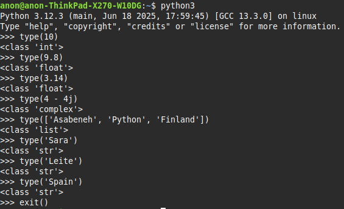

## 💻 Exercises - Day 1

### Exercise: Level 1

1. Check the python version you are using:

   _I'm using Python 3.12.3._

   

2. Open the python interactive shell and do the following operations. The operands are 3 and 4.

   - addition(+)
   - subtraction(-)
   - multiplication(\*)
   - modulus(%)
   - division(/)
   - exponential(\*\*)
   - floor division operator(//)

   

3. Write strings on the python interactive shell. The strings are the following:

   - Your name
   - Your family name
   - Your country
   - I am enjoying 30 days of python

   

4. Check the data types of the following data:

   - 10
   - 9.8
   - 3.14
   - 4 - 4j
   - ['Asabeneh', 'Python', 'Finland']
   - Your name
   - Your family name
   - Your country

   

### Exercise: Level 2

1. Create a folder named day*1 inside 30DaysOfPython folder. Inside day_1 folder, create a python file helloworld.py and repeat questions 1, 2, 3 and 4. Remember to use \_print()* when you are working on a python file. Navigate to the directory where you have saved your file, and run it.

_Done!_

### Exercise: Level 3

1. Write an example for different Python data types such as Number(Integer, Float, Complex), String, Boolean, List, Tuple, Set and Dictionary.
2. Find an [Euclidian distance](https://en.wikipedia.org/wiki/Euclidean_distance#:~:text=In%20mathematics%2C%20the%20Euclidean%20distance,being%20called%20the%20Pythagorean%20distance.) between (2, 3) and (10, 8)

*Done!*
